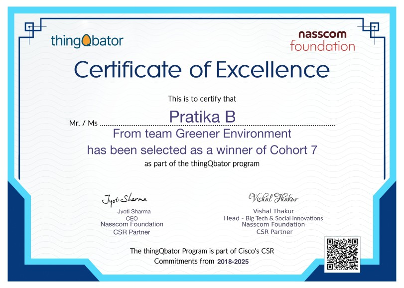
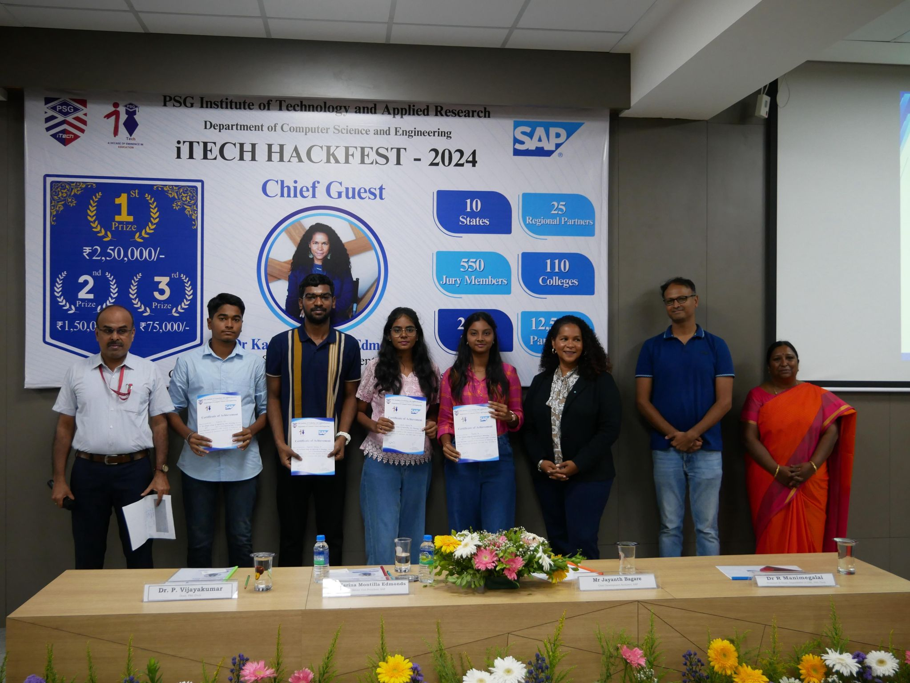
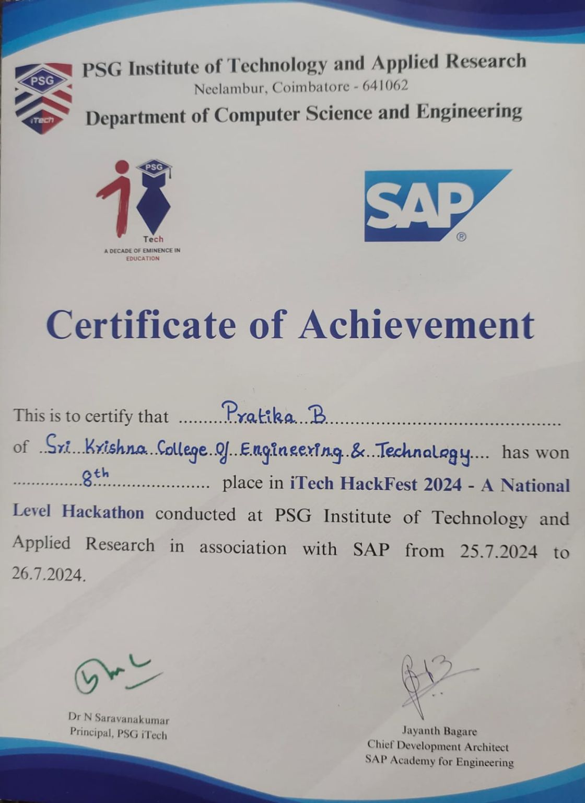

# 🌱 RENEWA – Green Credit Management Platform

<div align="center">
  
  
  
  
</div>

---

## 🔗 Quick Links

* 💻 GitHub: https://github.com/Pratika17/renewa-app-flutter
* 📄 Presentation (Pitch Deck): [View Slides](https://github.com/Pratika17/renewa-app-flutter/blob/main/presentation/Renewa-Thinqbator-Pitch.pdf)
* 🎥 Demo (Thinqbator Pitch): [Watch Here](https://www.youtube.com/watch?v=xqiPqHZQ08Y)
* 🎥 Demo (Hackathon Walkthrough): [Watch Here](https://youtu.be/euk26FyeCjY)

---

## 🌍 Overview

RENEWA is a sustainability-driven platform that integrates **environmental actions with financial incentives** through a **Green Credit Management System**.

Users participate in eco-missions, complete sustainability-driven tasks, and earn rewards—transforming environmental responsibility into an **engaging, trackable, and rewarding experience**.

---

## 🏆 Achievements

### 🥇 NASSCOM Thinqbator 7 Winner (2024)

<p align="center">
  
</p>

* National-level winner among **500+ startups**
* Recognized for **sustainability innovation**
* Evaluated on **impact, scalability, and execution**

### 🥈 PSG iTech Hackfest Finalist (2024)

<p align="center">
  
  
</p>

* Finalist among **12,500+ participants**
* Recognized for **UI/UX and product impact**

---

## ✨ Core Features

### 🌍 Eco-Missions & Campaigns

* Participate in structured sustainability campaigns
* Complete missions with defined deliverables
* Simple and direct participation model

---

### 🎯 Green Credit System

* Earn credits for eco-friendly activities
* Encourages long-term sustainable behavior

---

### 📊 Dashboard & Tracking

* Track completed missions and rewards
* Visualize environmental contributions

---

### 🤝 Community Engagement

* Connect users with environmental initiatives
* Promote collaboration and awareness

---

### 🎮 Gamification

* Rewards, milestones, and incentives
* Improves engagement and consistency

---

## 🌿 Activities Covered

* Tree Plantation
* Water Management
* Sustainable Agriculture
* Air Pollution Reduction
* Mangrove Conservation
* Solar Energy Adoption

---

## 🏗️ Architecture

### 🛠️ Tech Stack

* **Frontend:** Flutter (Mobile & Web)
* **Backend:** REST APIs
* **Architecture:** Modular & scalable
* **Other:** Gamification logic, UI/UX

---

### 📂 Project Structure

```id="f4as9o"
renewa/
├── lib/
├── assets/
├── presentation/
│   ├── renewa-presentation.pdf
│   └── screenshots/
├── README.md
```

---

## 📊 Presentation & Demo

* 📄 Presentation: [View Slides](https://github.com/Pratika17/renewa-app-flutter/blob/main/presentation/Renewa-Thinqbator-Pitch.pdf)
* 🎥 Thinqbator Pitch: [Watch Here](https://www.youtube.com/watch?v=xqiPqHZQ08Y)
* 🎥 Hackathon Demo: [Watch Here](https://youtu.be/euk26FyeCjY)

---

## 🚀 Getting Started

```bash id="b8o6le"
# Clone the repository
git clone https://github.com/Pratika17/renewa.git

# Navigate into the project
cd renewa

# Install dependencies
flutter pub get

# Run the app
flutter run
```

---

## 🔍 Use Cases

* Individuals tracking eco-friendly habits
* Communities promoting sustainability
* Organizations encouraging green practices
* Educational institutions for awareness

---

## 🚀 Future Enhancements

* AI-based sustainability recommendations
* IoT integration for real-time tracking
* Leaderboards and social features
* Green credit financial integrations
* Government/NGO collaborations

---

## 🤝 Contribution

1. Fork the repository
2. Create branch (`feature/your-feature`)
3. Commit changes
4. Push & open PR

---

## 📜 License

MIT License

---

## 👩‍💻 Author

**Pratika Baburaj**

* GitHub: https://github.com/Pratika17
* LinkedIn: https://linkedin.com/in/pratikababuraj

---

<div align="center">
  <p><strong>Building a sustainable future through technology 🌱</strong></p>
</div>
